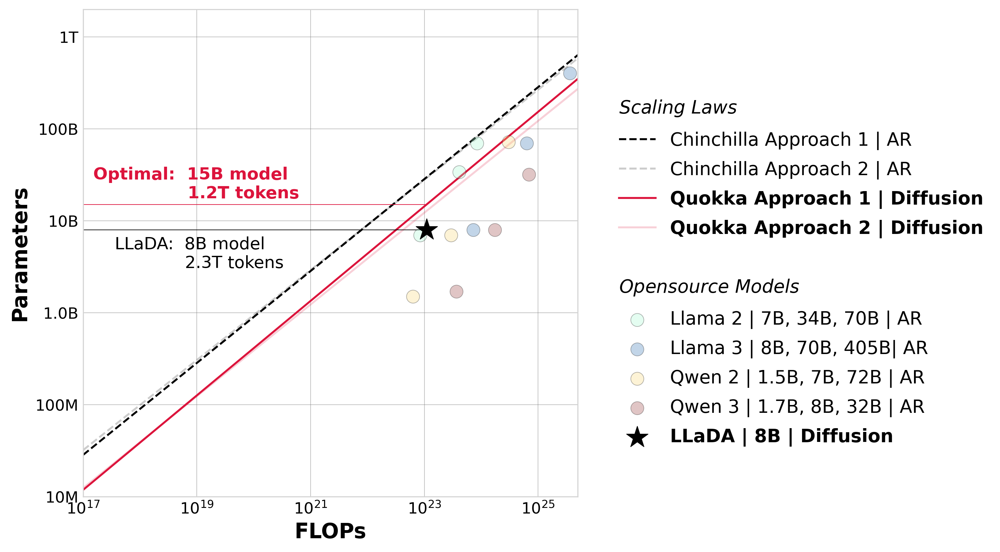

<div align="center">

<!-- TITLE -->
# **Training Optimal Large Diffusion Language Models**

[](https://jinjieni.github.io/Quokka/resources/pdfs/Training_Optimal_Large_Diffusion_Language_Models.pdf)
[]()


[Jinjie Ni†](https://jinjieni.github.io/), [Qian Liu](https://scholar.google.com/citations?user=bcbeUo0AAAAJ&hl=en), [Chao Du](https://duchao0726.github.io/), [Longxu Dou](https://longxudou.github.io/), [Hang Yan](https://scholar.google.com/citations?user=yigHzW8AAAAJ&hl=en), [Zili Wang](https://commencement.github.io/), [Tianyu Pang](https://p2333.github.io/), [Michael Qizhe Shieh](https://michaelshieh.com/)

†Correspondence to: Jinjie Ni \<jinjieni@nus.edu.sg\>
</div>

<p align="center" width="100%">

</p>

**Overlaid predictions from Chinchilla and Quokka (compute-constrained).** *We overlay the predictions from our approach 1 and 2, along with those from Chinchilla. Though scaling at the same pace, DLMs are 2-5x more data-hungry than AR models at the same FLOPs—favor smaller models and larger corpora. We mark the position of LLaDA in the same space, finding that it's severely over-trained with 2$\times$ smaller models and 2x more corpora against the Quokka efficient frontier. Meanwhile, wo show the positions of opensource models, finding that most models are over-trained compared with the Chinchilla efficient frontier, except some models from the Llama family.*

<br>

# Highlights
**We introduce Quokka, the first systematic scaling law for diffusion language models (DLMs), encompassing both compute-constrained and data-constrained regimes, and studying the key modeling and optimization designs. Quokka is a good friend of Chinchilla and provides wider scopes. We hope the results would bring short-term practical guidance in DLMs training and long-term inspirations for the whole AI community. We summarize some takeaways below:**

- **Compute-constrained law.** With fixed FLOPs $C$, the optimal parameters $N_{\mathrm{opt}}\!\propto\!C^{0.5}$ and data size $D_{\mathrm{opt}}\!\propto\!C^{0.5}$, scaling at the same pace; DLMs are *2--5*$\times$ more data-hungry than autoregressive (AR) models at the same $C$—favor smaller models and larger corpora (Figure 1). We provide a direct comparison with Chinchilla scaling law coefficients in Table 1 and their practical optimal allocation comparisons in Table 2 of the paper.

- **Data-constrained law.** Validation loss is U-shaped in epochs $e$; the onset of overfitting scales roughly as $e_{\mathrm{opt}}\!\propto\!U_D^{0.39}/N^{0.55}$, where $N$ is the model size and $U_D$ is the unique data size; e.g., a 10B model on $1$T unique tokens tolerates ~1,100 epochs before degradation. We provide practical allocation guidance in Table 3.

- **Joint allocation under data constraints.** For a larger unique data size $U_D$, the optimal parameter-epoch allocation uses *modestly larger* $N$ and *more* epochs–both $N_{\mathrm{opt}}$ and $e_{\mathrm{opt}}$ increase with $U_D$. We provide practical allocation guidance in Table 4.

- **Masked outperforms uniform diffusion at scale.** Absorbing-mask transitions consistently outperform uniform ones on pretrain loss and downstream metrics (§ 5.1).

- **Schedules and curricula.** A linear $\alpha_t$ schedule is strongest in most cases and most stable; poly2 performs better on some benchmarks; an easy to hard noise curriculum (clean-to-noisy $t$ sampling) accelerates early learning and yields small end-of-training gains (§ 5.2).

- **Losses.** MaskGIT loss (no importance sampling) converges faster initially, but the principled diffusion ELBO attains better final performance (§ 5.3).

- **Hyperparameters transfer.** Batch-size and learning-rate laws from AR models can be carried over for DLM training (§ 5.4).

- **Weight decay.** Little benefit at one epoch, but useful in long multi-epoch runs and for controlling parameter norms (stability in `bf16`); keep WD when repeating data heavily (§ 5.5).

<br>

# Citation
```
@article{ni2025quokka,
  title={Training Optimal Large Diffusion Language Models},
  author={Ni, Jinjie and Liu, Qian and Du, Chao and Dou, Longxu and Yan, Hang and Wang, Zili and Pang, Tianyu and Shieh, Michael Qizhe},
  journal={arXiv preprint arXiv:},
  year={2025}
}
```
